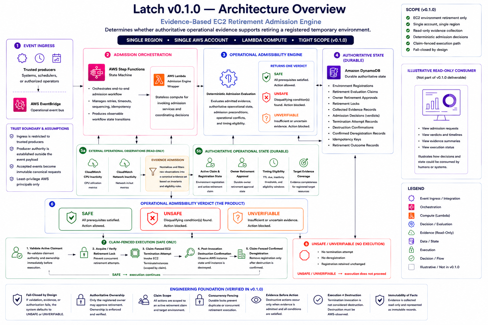

# Latch


## What is Latch?
Latch is an operational admissibility engine that determines whether cloud infrastructure is operationally safe to retire before destructive operations are permitted.

Rather than treating retirement as a direct execution request, Latch evaluates authoritative operational evidence to determine whether a registered environment is operationally admissible for retirement.

This transforms infrastructure retirement from a permission check into an evidence-based operational reasoning problem.

The following architecture illustrates the separation between trusted admission, operational reasoning, authoritative state, and claim-fenced execution.


## The operational problem
Cloud environments often remain running long after they are no longer needed because engineering teams cannot confidently prove that they are operationally safe to retire.

Traditional authorization systems answer: "May this action be performed?"

They do not answer: "Should this environment be retired?"

## Why IAM and policy are insufficient?
IAM policies and authorization systems determine whether a caller is permitted to perform an action.

They do not determine whether performing that action is operationally safe.

Authorization answers:

"May this action be performed?"

Operational admissibility answers:

"Should this environment be retired?"

Latch complements authorization by answering the second question before destructive operations are permitted.

## How Latch reasons
Latch evaluates retirement requests as an evidence-based reasoning workflow rather than a direct execution request.

A retirement request does not authorize infrastructure destruction on its own. Instead, it initiates an evaluation of whether the requested environment is operationally admissible for retirement.

The evaluation proceeds through a deterministic operational reasoning workflow:

```text
Registered Environment
        │
        ▼
Retirement Claim
        │
        ▼
Owner Approval
        │
        ▼
Operational Evidence Collection
        │
        ▼
Evidence Admission
        │
        ▼
Operational Admissibility Evaluation
        │
        ▼
SAFE
UNSAFE
UNVERIFIABLE
        │
        ▼
Claim-Fenced Execution Authorization
        │
        ▼
EC2 Termination
        │
        ▼
Independent Destruction Confirmation
        │
        ▼
Confirmed Deregistration
```

Only a SAFE verdict permits execution.

UNSAFE and UNVERIFIABLE are valid operational outcomes that prevent infrastructure retirement while preserving authoritative registration state.

Throughout the workflow, execution remains fenced by the active retirement claim and the authoritative registered owner. Operational evidence is evaluated before execution, and infrastructure state is updated only after independent confirmation that destruction has occurred.


## Design Principles

Latch is built around a small set of engineering principles:

- Evidence precedes execution.
- Operational admissibility is distinct from authorization.
- Destructive operations require deterministic operational reasoning.
- Authoritative state is preserved until destruction is independently confirmed.
- Operational reasoning is separated from cloud-provider implementation.

## Current capability (v0.1.0)

-  Registered EC2 environment retirement
-  Retirement claims
-  Authoritative owner approval
-  Operational evidence collection
-  Evidence admission
-  Deterministic operational admissibility evaluation
-  SAFE / UNSAFE / UNVERIFIABLE operational verdicts
-  Claim-fenced execution
-  Independent destruction confirmation
-  Confirmed deregistration

## Scope of v0.1.0

The initial release intentionally focuses on a single end-to-end retirement workflow.

The following capabilities are intentionally outside the scope of v0.1.0:

- Multi-cloud providers
- Non-EC2 infrastructure resources
- User interface
- Scheduling
- Automated discovery
- Recommendation generation

## Repository structure
The repository follows a layered architecture separating domain reasoning, application orchestration, infrastructure integrations, and deployment infrastructure definitions.

```text
src/
└── latch/
    ├── application/
    ├── domain/
    └── infrastructure/

tests/

infrastructure/
└── terraform/

docs/
└── architecture/
```

## Running locally

### Requirements

- Python 3.13
- uv
- Terraform

Install dependencies:

```bash
uv sync --dev
```

Start the API:

```bash
uv run uvicorn latch.main:app --reload
```

---

## Validation

Run the complete validation suite:

```bash
uv run ruff check .
uv run ruff format --check .
uv run mypy src
uv run pytest

terraform -chdir=infrastructure/terraform fmt -check
terraform -chdir=infrastructure/terraform validate

uv run pre-commit run --all-files
```

## Roadmap

Future releases will expand supported infrastructure resources, operational evidence, and execution workflows while preserving the evidence-first operational admissibility model established in v0.1.0.

## Project Status

**Version:** v0.1.0

Latch currently implements the first complete end-to-end operational admissibility workflow for cloud infrastructure retirement.

The project is under active development, with future releases expanding supported infrastructure resources and operational evidence while preserving the operational reasoning model established in v0.1.0.

## License
Apache 2.0
