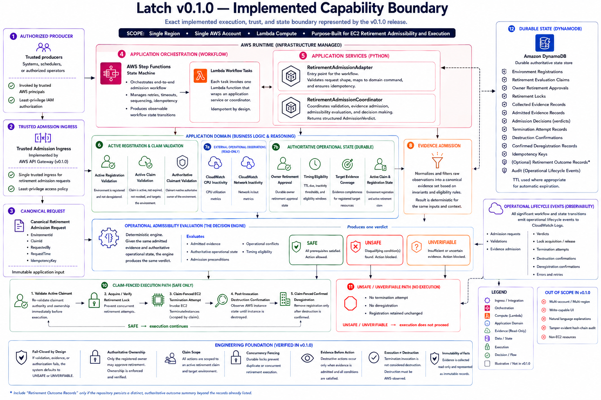

# Latch Architecture

Latch v0.1.0 implements a governed retirement workflow for registered EC2
environments.

The architecture documentation is organized by product boundary and execution
stage. The diagrams provide the high-level and implementation views; the
specifications define the detailed contracts and invariants.

## Architecture Diagrams

### System Architecture

The system view presents the principal trust, admission, execution, and
supporting-infrastructure boundaries.

### Implementation Architecture

The implementation view maps those boundaries to the deployed runtime,
including trusted ingress, Step Functions, Lambda, application services,
evidence collection, DynamoDB persistence, EC2 execution, destruction
confirmation, and failure handling.

## Registration and Environment Identity

- [Environment registration API](environment-registration-api.md)
- [Environment resource-target boundary](environment-resource-target-boundary.md)
- [DynamoDB active registration](dynamodb-active-registration.md)
- [TTL-due registration selection](ttl-due-registration-selection.md)

## Approval, Locking, and Claims

- [Owner retirement approval](owner-retirement-approval.md)
- [Durable owner retirement approval](durable-owner-retirement-approval.md)
- [Owner approval participation](owner-approval-participation.md)
- [Durable retirement lock](durable-retirement-lock.md)
- [Retirement lock participation](retirement-lock-participation.md)
- [Retirement evaluation claim](retirement-evaluation-claim.md)
- [Active claim validation](active-claim-validation.md)

## Evidence and Evaluation Context

- [Evidence boundary](evidence-boundary.md)
- [Evidence participation](evidence-participation.md)
- [Evidence proposition classification](evidence-proposition-classification.md)
- [Admission evaluation context](admission-evaluation-context.md)
- [Established operational proposition set](established-operational-proposition-set.md)
- [Claim-scoped operational evidence collection](claim-scoped-operational-evidence-collection.md)
- [Registered-target operational evidence coverage](registered-target-operational-evidence-coverage.md)

## Operational Assertions and Conflict Recognition

- [Operational assertion dimensions](operational-assertion-dimensions.md)
- [Operational assertion projection](operational-assertion-projection.md)
- [Operational assertion compatibility](operational-assertion-compatibility.md)
- [Operational assertion temporal relationship](operational-assertion-temporal-relationship.md)
- [Operational dimension association set](operational-dimension-association-set.md)
- [Operational conflict set](operational-conflict-set.md)
- [Operational conflict status](operational-conflict-status.md)
- [Operational conflict recognition](operational-conflict-recognition.md)
- [Operational conflict recognition coverage](operational-conflict-recognition-coverage.md)

## Operational Evidence Collection

- [CloudWatch CPU inactivity collection](cloudwatch-cpu-inactivity-collection.md)
- [CloudWatch CPU inactivity progression](cloudwatch-cpu-inactivity-progression.md)
- [CloudWatch network inactivity collection](cloudwatch-network-inactivity-collection.md)
- [Operational retirement readiness](operational-retirement-readiness.md)

## Admission and Authorization

- [Retirement prerequisite status](retirement-prerequisite-status.md)
- [Retirement timing eligibility](retirement-timing-eligibility.md)
- [Retirement admission verdict](retirement-admission-verdict.md)
- [Retirement admission coordination](retirement-admission-coordination.md)
- [Retirement execution authorization](retirement-execution-authorization.md)

## Execution, Confirmation, and Deregistration

- [EC2 termination invocation](ec2-termination-invocation.md)
- [EC2 termination adapter](ec2-termination-adapter.md)
- [Claim-fenced EC2 termination attempt](claim-fenced-ec2-termination-attempt.md)
- [EC2 destruction confirmation](ec2-destruction-confirmation.md)
- [EC2 destruction confirmation adapter](ec2-destruction-confirmation-adapter.md)
- [Post-invocation EC2 destruction confirmation](post-invocation-ec2-destruction-confirmation.md)
- [Claim-fenced confirmed deregistration](claim-fenced-confirmed-deregistration.md)

## Release Scope

Latch v0.1.0 is intentionally limited to one controlled retirement workflow
for registered EC2 environments.

The release does not include:

- multi-cloud execution;
- non-EC2 retirement targets;
- automated resource discovery;
- recommendation generation;
- scheduled retirement;
- a user-facing dashboard;
- LLM participation in admission decisions.

These exclusions preserve a narrow, deterministic, and reviewable product
boundary.
